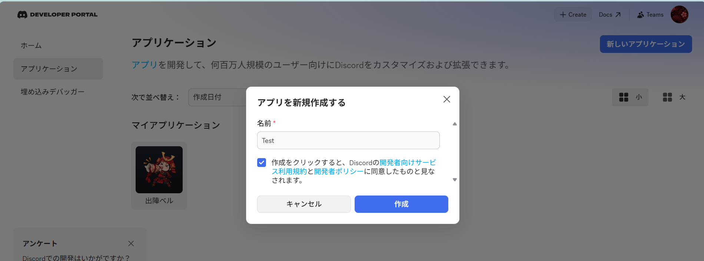
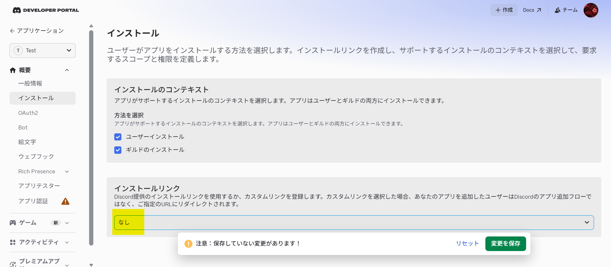
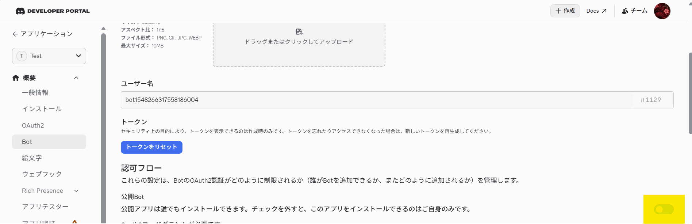
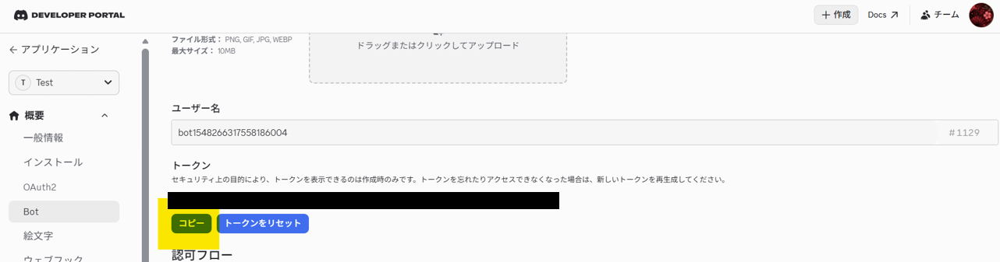

# キングショット出陣カウントダウン

複数人で**同時着弾**させるための共通カウントダウン。
Discordのボイスチャンネルに残り秒数を読み上げるBotです。

行軍時間は人によって違う（40秒の人、52秒の人、65秒の人…）ので、
**全員に同じカウントを流し、各自が自分の秒数のところで出陣する**方式にしています。
カウント側は誰が何秒かを知る必要がありません。80から0まで正確に読むだけです。

音声は**事前に1本のwavへ焼いておき、本番は再生するだけ**。
カウント中に合成しないので、再生が始まればズレようがありません。

| ドキュメント | 中身 |
|---|---|
| **[USAGE.md](USAGE.md)** | 同盟メンバー向けの使い方 |
| **[OPERATIONS.md](OPERATIONS.md)** | 運用の手引き（起動停止、サーバー追加、覚え書き） |
| **[NOTES.md](NOTES.md)** | 設計の考え方と、調べた記録 |

---

## 必要なもの

| | 用途 |
|---|---|
| **Python 3.8以上** | 全部 |
| **[VOICEVOX](https://voicevox.hiroshiba.jp/)** | 音声を作るときだけ。焼き済みを流すだけなら不要 |
| **Discord Bot のトークン** | Botを動かすときだけ |

`bot.py` 以外は**標準ライブラリだけで動きます**。

## 開発環境をつくる

### 1. 仮想環境とライブラリ

```bash
python -m venv .venv
.venv/Scripts/python -m pip install -r requirements.lock
```

`requirements.txt` を変えたらロックを作り直します（`pip-tools` が要ります）。

```bash
.venv/Scripts/python -m piptools compile requirements.txt --output-file requirements.lock
```

### 2. VOICEVOX

[公式サイト](https://voicevox.hiroshiba.jp/)からインストールして起動します。
起動していると `http://127.0.0.1:50021` でHTTP APIが待ち受けます。

```bash
.venv/Scripts/python voice_countdown.py --list-speakers
```

話者IDの一覧が出れば疎通OKです。

### 3. Discord Bot のトークン

#### アプリを作る

[Developer Portal](https://discord.com/developers/applications) を開き、
右上の **New Application** からアプリを作ります。
テンプレートを聞かれたら **サーバーまたはコミュニティのBotを作成** を選びます。



#### 公開Botをオフにする

左メニューの **Bot** を開き、**公開Bot（Public Bot）** をオフにします。
自分だけがこのBotをサーバーへ追加できる状態になります。

**先に インストール タブで「デフォルトの認証リンク」を「設定しない」に
変えておくこと。** 順番が逆だとエラーで弾かれます。





#### 特権インテントは全部オフのまま

同じ画面の **Privileged Gateway Intents** は3つとも触りません。
スラッシュコマンドとボタンだけで動くので不要です。
オフのままにしておくと、メッセージもメンバー情報も読めないBotになります。

#### トークンを発行する

**Reset Token** を押します。多要素認証を求められたら通してください。

**トークンは一度しか表示されません。** すぐコピーします。
失くしてもリセットすれば作り直せます（古いトークンは無効になります）。



#### .env に貼る

```bash
cp .env.example .env
```

`DISCORD_TOKEN=` の右に貼ります。クォートで囲まず、前後に空白も入れません。

```
DISCORD_TOKEN=MTIzNDU2Nzg5...
```

`.env` は `.gitignore` で除外してあるのでコミットされません。

> **トークンを含むスクリーンショットは絶対に置かないこと。**
> このリポジトリは公開なので、画像に写った文字列も読まれます。

> サーバーへの招待手順は [OPERATIONS.md](OPERATIONS.md) にあります。

---

## 実行方法

### Discord Bot

```bash
.venv/Scripts/python bot.py
```

`start_bot.bat` をダブルクリックしても同じです。
起動時にボタンぶんの音声を先に焼くので、押した瞬間に鳴ります。
止めるときは Ctrl+C。

| コマンド | 用途 |
|---|---|
| `/panel` | ボタンを設置する。一度打てば以降は押すだけ |
| `/countdown 開始 終了` | その場で秒数を指定して流す |
| `/stop` | 再生を止めて退出する |

### 音声を焼く

```bash
.venv/Scripts/python voice_countdown.py 45 0 --speaker 3 --speed 1.2 --play
```

Bot用に焼くときは `--discord` を付けます（48kHzステレオになります）。

```bash
.venv/Scripts/python voice_countdown.py 45 0 --discord
```

| オプション | 意味 |
|---|---|
| `--speaker N` | 話者ID（既定 3 = ずんだもん） |
| `--speed N` | 話す速さ。読みが1秒に収まらないときは上げる |
| `--lead N` | 再生開始からカウント開始までの無音（秒） |
| `--cue よーい` | カウント開始前に読む合図 |
| `--discord` | 48kHz・ステレオで焼く（Bot用） |
| `--play` | 作ったあと再生する |
| `--force` | キャッシュを無視して作り直す |
| `--list-speakers` | 話者一覧を表示して終了 |

一度焼いたファイルは `voice/` に残り、次からは即座に再生されます。

### テキスト版（Discord不要）

```bash
python countdown.py 60 30
```

| オプション | 意味 |
|---|---|
| `start` `end` | 開始・終了の残り秒数（既定 45 → 0） |
| `--step N` | N秒刻みで読む |
| `--dense N` | 残りN秒以下だけは毎秒読む |
| `--naive` | ズレ補正なしで動かす（比較用） |

## テスト

```bash
.venv/Scripts/python -m unittest discover -s tests -t .
```

60件。1秒かかりません。

| ファイル | 見ているもの | モック |
|---|---|---|
| `tests/test_countdown.py` | スケジュールとズレ補正 | 時計 |
| `tests/test_voice_countdown.py` | VOICEVOXへの要求と波形の組み立て | `urlopen` |
| `tests/test_bot.py` | コマンドの分岐と再生の流れ | interaction / ボイス接続 |

`test_bot.py` だけ discord.py が要ります。残り39件は標準ライブラリだけで動くので、
discord.py を入れていない環境でも回せます。

```bash
python -m unittest tests.test_countdown tests.test_voice_countdown
```

---

## ファイル構成

| | 中身 |
|---|---|
| `bot.py` | Discord Bot 本体 |
| `start_bot.bat` | Botの起動用。ダブルクリックで動く |
| `voice_countdown.py` | VOICEVOXで音声を焼く。Botもこれを呼ぶ |
| `countdown.py` | テキスト表示のカウントダウン |
| `countdown_argv.py` | 学習用。同じことを `sys.argv` だけで書いた版 |
| `tests/` | テスト一式 |
| `tools/` | アイコン・バナーの生成、停止スクリプト |
| `assets/` | アイコンとバナー |
| `voice/` | 焼いた音声（生成物。gitには入れない） |
| `logs/` | 動作の記録（生成物。gitには入れない） |

### 設定（`.env`）

| キー | 既定 | 意味 |
|---|---|---|
| `DISCORD_TOKEN` | （必須） | Botのトークン |
| `VOICEVOX_SPEAKER` | `3` | 話者ID |
| `VOICEVOX_SPEED` | `1.2` | 話す速さ |
| `COUNTDOWN_PRESETS` | `45,60,30` | パネルのボタン（最大25個） |
| `VOICEVOX_HOST` | `http://127.0.0.1:50021` | VOICEVOXのURL |

前置きの無音と合図は `bot.py` 冒頭の `LEAD_SECONDS` / `CUE_TEXT` で変えます。

### 既知の制約

- **1つのサーバーで同時に流せるのは1本だけ。** ボイス接続が1つしか張れないため。
  別サーバーどうしなら同時に流せる
- 設定（話者・速さ・ボタン）は全サーバー共通
- 同じアカウントは同時に1つのVCにしか入れないので、遅延の確認は
  複数人でないとできない（Discordの仕様）

---

## クレジット

音声: **VOICEVOX:ずんだもん**

VOICEVOXの音源はクレジット表記が必須（商用・非商用を問わない）。
話者を変えたときは、その話者名に書き換えること。

- [VOICEVOX](https://voicevox.hiroshiba.jp/)
- [東北ずん子・ずんだもん 音源利用規約](https://zunko.jp/con_ongen_kiyaku.html)
